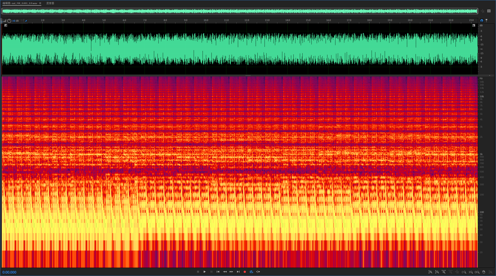
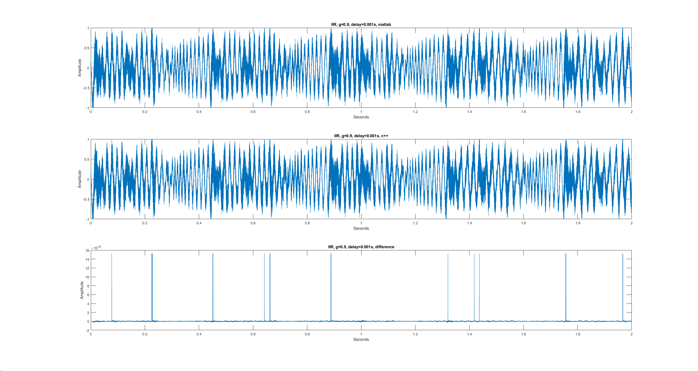
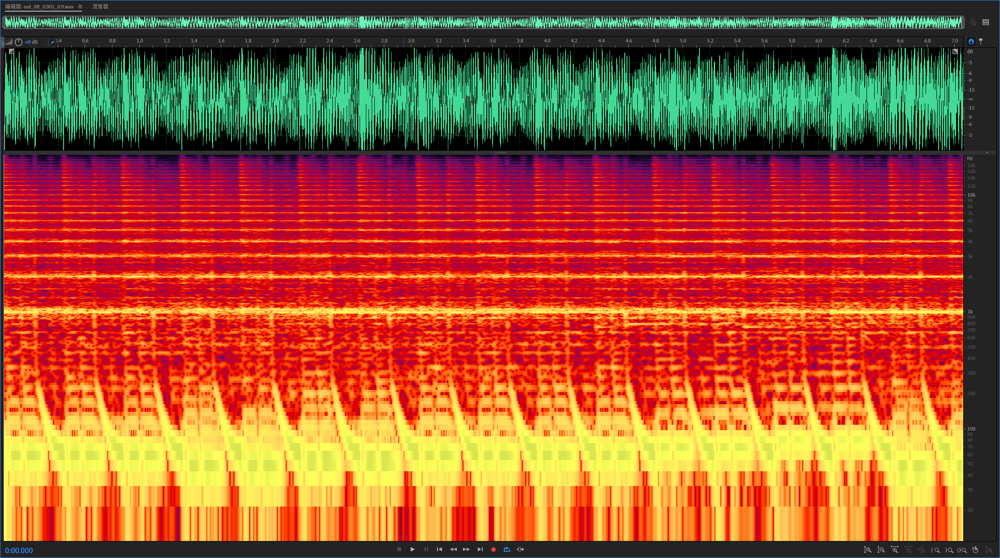

## FIR Result

Notice the difference is around 1e-5, which reflects the bit depth of input (16-bit). The spectrum also shows patterns of comb filter:

## IIR Result

Notice the peaks in difference is around 1e-6. The peaks in difference are caused by different ways of clipping in matlab and wav.

The IIR spectrum was more "sharper" compared to FIR ones when the gain is the same:

The peaks are more sharper.