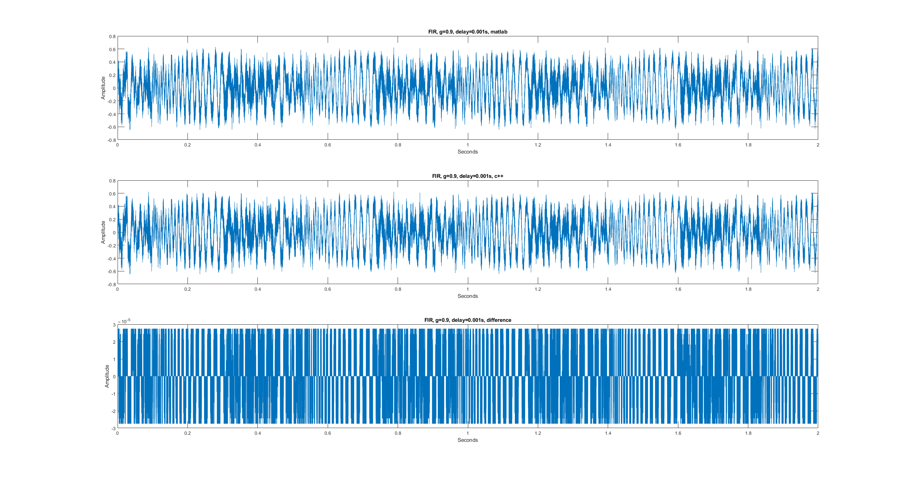

## FIR Result

Notice the difference is around 1e-5, which reflects the bit depth of input (16-bit).

## IIR Result

Notice the peaks in difference is around 1e-6. The peaks in difference are caused by different ways of clipping in matlab and wav.