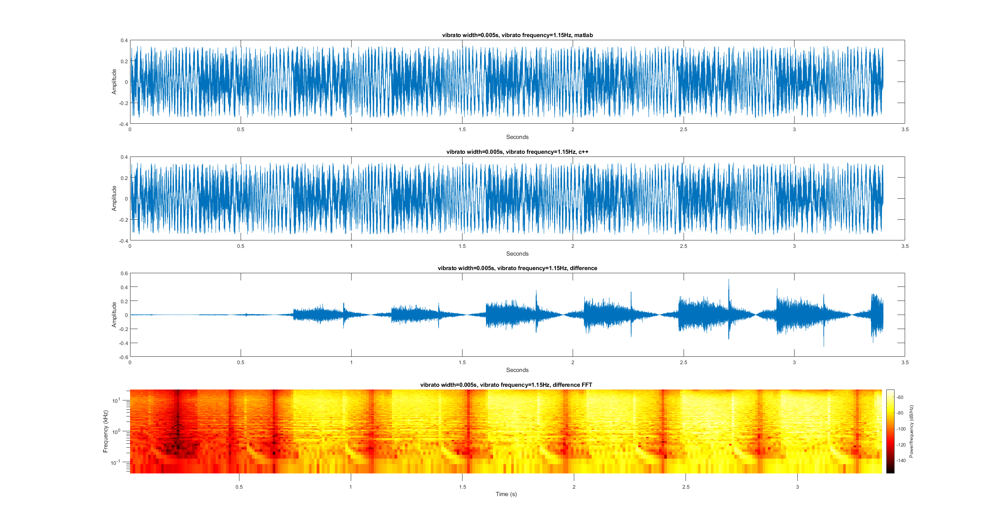
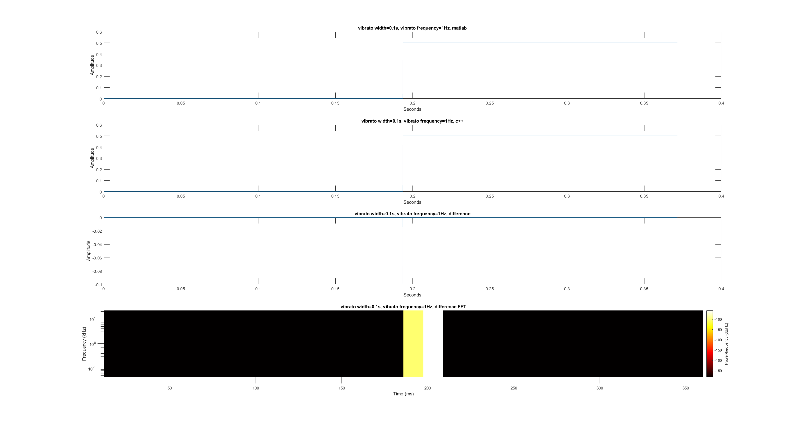
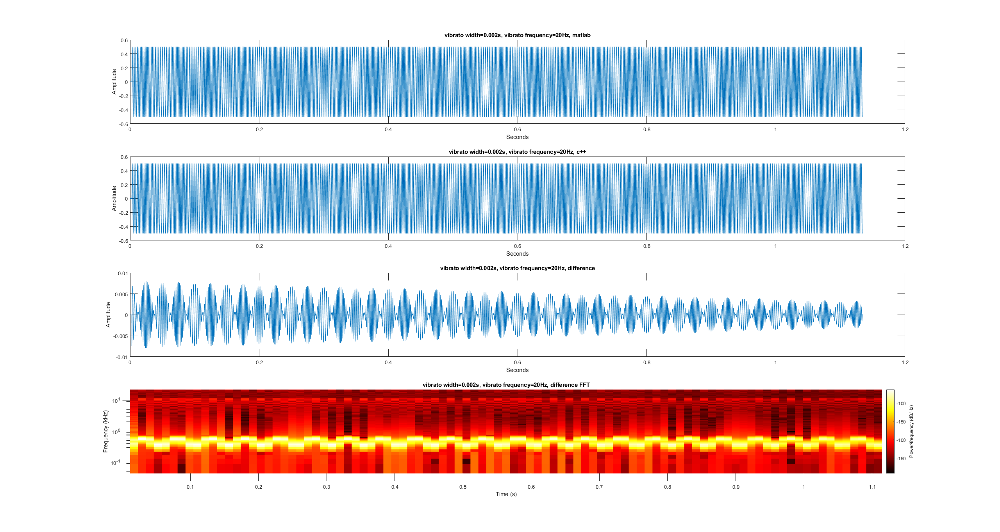

The error starts to accumulate as the tiny difference of time starts to accumulate. But in general, they are still similar signals and most error are in the high-frequency range and the power is around -50dB/Hz.

We also tested the program's performance on DC input and 440hz sinusoid signal input. The result are shown below:

And the performance are better than real world signals as they has less high-frequency components.