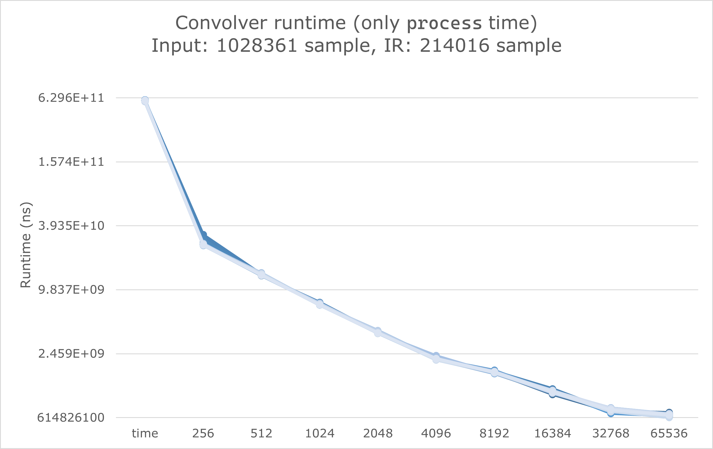

## Runtime

We test time domain FIR convolver, frequency domain FFT convolver with block size 256, 512, 1024, 2048, 4096, 8192, 16384, 32768, and 65536. We use `std::chrono::steady_clock` to evaluate runtime more accurately than `ctime`. The runtime unit is nanosecond (1e-9s).

We run program on the two pairs of input data:

- Short: Input signal 50000 sample, IR signal 50000 sample, 100 run for each configuration.
- Long: Input signal 1028361 sample, IR signal 214016 sample, 50 run for each configuration.

All 1500 experiments are run on the same computer (CPU: Intel(R) Core(TM) i7-8650U CPU @ 1.90GHz; System: Windows 10 build 19043.1645) with no other system load. The executable is compiled using `x86_64 release` configuration with `-O3` optimization flag enabled.

The raw runtime data is available [here (short)](https://github.com/medioqrity/2022-MUSI6106/blob/assignment3_fastconv/runtime.csv) and [here (long)](https://github.com/medioqrity/2022-MUSI6106/blob/assignment3_fastconv/runtime_long.csv). The experiments are automatically conducted & collected by [this script](https://github.com/medioqrity/2022-MUSI6106/blob/assignment3_fastconv/exp_runner.py). Notice you have to modify source code to run convolver with different input & IR files.

Here are the visualized figures:

Notice that the y-axis is $\log_2$ scale. Compared with time domain convolution, the fastest FFT convolver is ~293.5781x and ~908.9543x faster respectively. It's apparent that the performance gap between time domain convolution and FFT will continue to increase when the input size increases.
