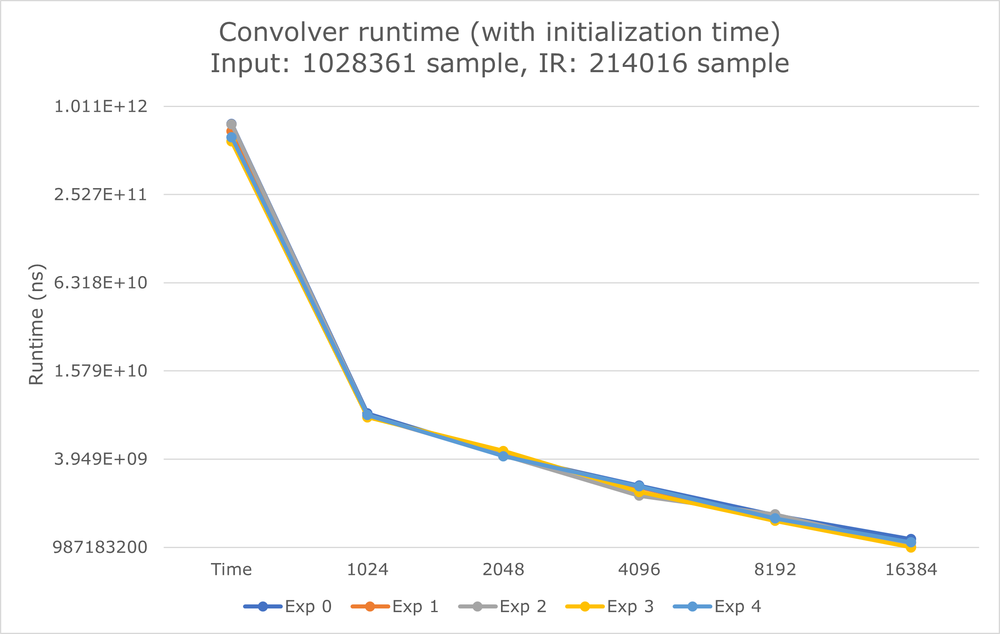

## Runtime (with convolver initialization time included)

We run 5 experiments for each convolver settings. We test time domain FIR convolver, frequency domain FFT convolver with block size 1024, 2048, 4096, 8192, and 16384. We use `std::chrono::steady_clock` to evaluate runtime more accurately than `ctime`. The runtime unit is nanosecond (1e-9s).

We run all 30 experiments on the same input file (1028361 samples) and IR file (214016 samples).

The experiment raw data is listed below:

| BlockSize | Exp 0        | Exp 1        | Exp 2        | Exp 3        | Exp 4        | AVG          |
| --------- | ------------ | ------------ | ------------ | ------------ | ------------ | ------------ |
| Time      | 769723443200 | 685043909100 | 765210896800 | 583107237400 | 623592244100 | 685335546120 |
| 1024      | 8096100400   | 7762510300   | 7874542900   | 7633531000   | 7898791200   | 7853095160   |
| 2048      | 4179570200   | 4224821600   | 4201036400   | 4489978400   | 4129135900   | 4244908500   |
| 4096      | 2603565700   | 2533137500   | 2222926800   | 2361352100   | 2574653500   | 2459127120   |
| 8192      | 1632481400   | 1547309900   | 1658021800   | 1495480300   | 1553196800   | 1577298040   |
| 16384     | 1124492200   | 1060606600   | 999837300    | 987183200    | 1066432400   | 1047710340   |

And the visualized figure for more intuitive comparison:

Notice that the y-axis is $\log_2$ scale. Compared with time domain convolution, the fastest FFT convolver is ~654.1269x faster.

## Some observations

Under $\log_2$ scale, runtime between FFT with exponentially increasing block appears to be exponentially decreasing. That is to say, doubling block size approximately halves the runtime.

If we perform linear regression on FFT part data, we have

The exponential part ($e^{-0.502x}$) clearly supports the previous observation that doubling block size approximately halves (actually ~0.605) the runtime. If we run FFT with block size = 2, we should have approximately the same runtime with the time domain convolution.