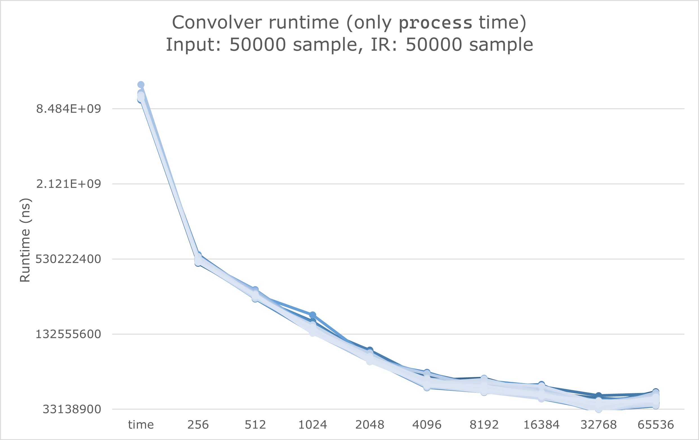

## Runtime (`process` call only)

We run 100 experiments for each convolver settings. We test time domain FIR convolver, frequency domain FFT convolver with block size 256, 512, 1024, 2048, 4096, 8192, 16384, 32768, and 65536. We use `std::chrono::steady_clock` to evaluate runtime more accurately than `ctime`. The runtime unit is nanosecond (1e-9s).

We run all 1000 experiments on the same input file (50000 samples) and IR file (50000 samples) on the same computer (CPU: Intel(R) Core(TM) i7-8650U CPU @ 1.90GHz; System: Windows 10 build 19043.1645) with no other system load. The executable is compiled using `x86_64 release` configuration with `-O3` optimization flag enabled.

The experiment raw data is available [here](https://github.com/medioqrity/2022-MUSI6106/blob/assignment3_fastconv/runtime.csv). The experiments are automatically conducted & collected by [this script](https://github.com/medioqrity/2022-MUSI6106/blob/assignment3_fastconv/exp_runner.py).

This is the visualized figure:

Notice that the y-axis is $\log_2$ scale. Compared with time domain convolution, the fastest FFT convolver is ~343.9192x faster.
